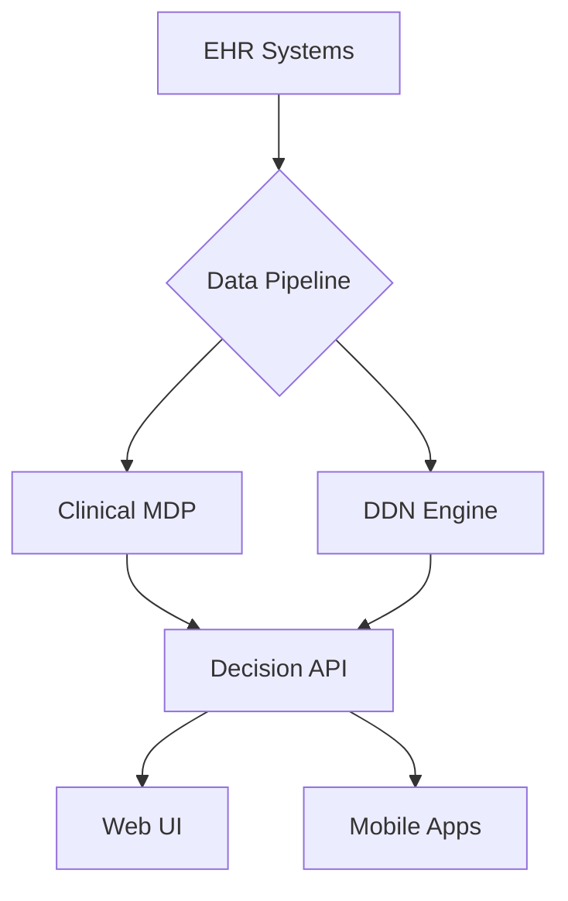

# CDSS Technical Documentation

## Architecture


## Core Components
### MDP Engine
```python
class ClinicalMDP:
    def value_iteration(self, threshold=1e-5):
        while delta >= threshold:
            # Vectorized state updates
            new_values = np.max(self.q_values, axis=1)
            delta = np.max(np.abs(new_values - self.values))
```

### DDN Engine
- Dynamic belief updates
- Parallelized particle filtering
- Contextual reward shaping

## API Reference
### POST /api/recommendations
```curl
curl -X POST 'https://api.cdss.org/recommendations' \
  -H 'Authorization: Bearer $TOKEN' \
  -d '{"patient_id": "123", "context": {"comorbidities": [...]}}'
```

Response:
```json
{
  "recommendations": [
    {
      "treatment": "Warfarin 5mg",
      "confidence": 0.92,
      "nnt": 8,
      "qalys": 4.2
    }
  ]
}
```

## Performance Tuning
1. **Caching**:
```python
@lru_cache(maxsize=1024)
def get_evidence_weights(diagnosis):
    # Evidence-based weighting
```

2. **Async Processing**:
```python
async def batch_simulate(patient_ids):
    async with AsyncSession() as session:
        return await asyncio.gather(
            *[simulate_patient(p_id, session) for p_id in patient_ids]
        )
```

## Security Protocol
- OAuth2 with PHI scopes
- AES-256 data encryption
- Audit logging
```python
class AuditMiddleware(BaseHTTPMiddleware):
    async def dispatch(self, request, call_next):
        log_activity(request)
```

## Monitoring
Grafana Dashboard:
- Decision latency
- Model accuracy
- API error rates
- Cache hit ratio
